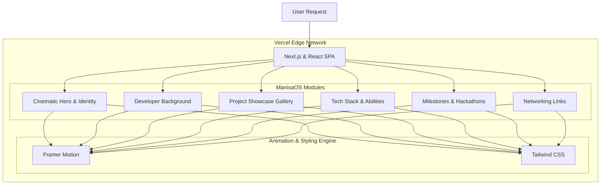

<div align="center">

# 💻 ManisaOS
### Cinematic Developer Portfolio & Personal Ecosystem

*A futuristic developer portfolio built to showcase projects, technical skills, and full-stack engineering work through an immersive web experience.*


</div>

---

# 📖 Overview

ManisaOS is a futuristic developer portfolio and personal ecosystem built to showcase projects, technical skills, achievements, creative interests, and full-stack engineering work through an immersive and modern web experience.

Designed with a cinematic UI philosophy, ManisaOS combines interactive frontend systems, smooth animations, responsive layouts, and developer-focused storytelling into a unified digital identity platform. The platform is inspired by futuristic operating systems, modern SaaS dashboards, and immersive portfolio experiences.

---

# ✨ Features

- 📱 **Fully Responsive Design:** Adapts flawlessly across mobile and desktop environments.
- 🎬 **Smooth Page Transitions:** Fluid navigation driven by Framer Motion.
- 🎨 **Modern Glassmorphism:** Layered, translucent UI components with neon gradients.
- ⚡ **Optimized Rendering:** Fast, performant frontend architecture using Next.js.
- 📖 **Structured Storytelling:** Dedicated sections for personal background, skills, and projects.
- 🧩 **Modular Component Architecture:** Clean and scalable codebase.

---

# 🏗 Architecture



---

# 🛠 Tech Stack

| Category | Technology | Purpose |
|----------|------------|---------|
| **Frontend** | Next.js, React, TypeScript | Core application logic and SSR/SSG framework |
| **Styling** | Tailwind CSS | Utility-first responsive design and glassmorphism |
| **Animation** | Framer Motion | Advanced UI transitions and interactive motion |
| **Deployment** | Vercel | High-performance edge network hosting |

---

# 🎨 Design Philosophy

ManisaOS follows a futuristic and cinematic design system focused on:
- Immersive storytelling and premium portfolio aesthetics
- Minimal but highly expressive UI
- Developer-centric presentation

**Visual Architecture:**
- Dark neutral palettes
- Neon gradients
- Layered glassmorphism
- Responsive animations

Inspired by futuristic operating systems, modern SaaS products, developer dashboards, and AI-native interfaces.

---

# 📸 Screenshots

### 🏠 Home Page


---

### 👩💻 About Page


---

### 🚀 Projects Section


---

### 🛠️ Skills Section


---

### 🏆 Achievements Section


---

### 📩 Contact Section


---

# ⚙️ Installation & Setup

## 1. Clone the repository
```bash
git clone https://github.com/Khushi1310-nayak/ManisaOS.git
cd ManisaOS
```

## 2. Install dependencies
```bash
npm install
```

## 3. Run Development Server
```bash
npm run dev
```

---

# 🚀 Future Roadmap

- Interactive project case studies
- Integrated blog system
- AI-powered portfolio assistant
- Dynamic project filtering
- Advanced motion interactions
- Theme customization system
- Desktop portfolio experience
- Performance analytics integration

---

# 🤝 Contributing

Contributions are welcome!

Feel free to fork the repository, create a feature branch, and submit a pull request.

---

# 📜 License

This project is licensed under the MIT License.

---

# 👩💻 Author

## **Manisa Nayak**

🎓 Student | Full-Stack Developer | AI Product Builder

Passionate about:
- Full-Stack Architecture
- User Experience (UI/UX)
- AI Automation & Product Building

### Connect with Me

**Portfolio:** https://manisa-os.vercel.app/  
**GitHub:** https://github.com/Khushi1310-nayak  
**LinkedIn:** https://www.linkedin.com/in/manisa-nayak-185bb5378/

---

## ⭐ If you found this project interesting, consider giving it a Star!
